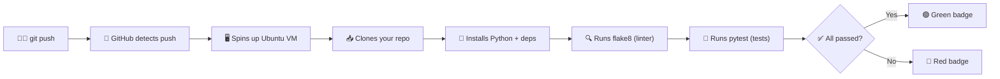

# TP4 — CI/CD, Monitoring & Evaluation

## 📖 Context

Your pipeline is tested, logged, and production-ready code-wise. The final step is **industrialization**: making sure it runs automatically, is monitored, and can be deployed reliably.

This is the evaluation TP — your deliverables at the end of this session will be graded.

---

## 🎯 Objective

1. Set up **GitHub Actions** CI/CD pipeline (lint → test → report)
2. Add a **monitoring dashboard** (pipeline execution metrics)
3. Package the project for **production deployment**
4. Prepare your **presentation deliverables**

---

## 📋 Prerequisites

- TP1, TP2, TP3 completed (pipeline working, tested, logged)
- GitHub repository with all code pushed

---

## Step 1 — GitHub Actions CI/CD (30 min)

### What is GitHub Actions?

GitHub Actions is a **CI/CD** (Continuous Integration / Continuous Deployment) platform built into GitHub. It automates tasks every time you push code.

**In simple terms:** it's a robot that runs your tests automatically every time you do `git push`.

### How does it work?



**Step by step:**

1. You do `git push` to your repository
2. GitHub sees the push and reads `.github/workflows/ci.yml`
3. It creates a **temporary Ubuntu machine** (called a "runner")
4. It clones your repo on that machine
5. It runs each **step** defined in the YAML file sequentially
6. If all steps succeed → ✅ green. If any step fails → ❌ red
7. You see the result in **GitHub → your repo → "Actions" tab**

### Key concepts

| Concept | Description | Example |
|---------|------------|---------|
| **Workflow** | A YAML file that defines what to automate | `.github/workflows/ci.yml` |
| **Trigger (`on:`)** | When to run the workflow | `on: push` = every time you push |
| **Job** | A set of steps that run on one machine | `lint-and-test` |
| **Step** | A single action (run a command or use a pre-made action) | `- name: Run tests` |
| **`uses:`** | Use a pre-made action from GitHub Marketplace | `uses: actions/checkout@v4` |
| **`run:`** | Execute shell commands (like in your terminal) | `run: pytest tests/ -v` |
| **`env:`** | Set environment variables for a step | `RDS_HOST: localhost` |

### 1.1 Complete the workflow file

📁 **File:** `.github/workflows/ci.yml`

The file is already mostly complete. The first 4 steps (checkout, Python setup, install dependencies, linter) are done for you.

**Your task:** Uncomment **Step 5** (Run tests with coverage) — it's the block starting with `# - name: Run tests with coverage`.

> 💡 **Why fake environment variables?** On the CI machine, there's no real PostgreSQL database. But your tests use `@patch` (mocks), so they never actually connect. We just need the variables to exist so Python doesn't crash on `os.getenv()`.

### 1.2 Push and verify

```bash
git add .github/workflows/ci.yml
git commit -m "ci: add GitHub Actions CI pipeline"
git push
```

Then go to **GitHub → your repo → Actions tab** to see it run.

> ✅ **Checkpoint**: Green CI badge on your repository.

---

## Step 2 — Pipeline Monitoring (30 min)

### Principle

In production, you need to know:
- ✅ Did the pipeline run successfully?
- ⏱ How long did each step take?
- 📊 How many rows were processed?
- ❌ What failed and why?

### 2.1 Add execution metrics

📁 **File:** `src/monitoring.py`

The file already contains two dataclasses (`StepMetrics` and `PipelineReport`) with some methods to complete.

**Your task:** Complete the 3 methods in `PipelineReport`:
- `add_step()` — append a step to the list
- `to_json()` — serialize to JSON using `dataclasses.asdict()`
- `save()` — write to a file

> 💡 Use `@dataclass` with `field(default_factory=list)` for mutable default values. Use `dataclasses.asdict()` to convert to a dict for JSON serialization.

### 2.2 Integrate metrics into the pipeline

📁 **File:** `pipeline.py`

The file has TODO comments showing you how to track each step. The pattern is:

```python
step = StepMetrics(step_name="extract")
step.status = "running"
step.start_time = datetime.now(timezone.utc).isoformat()
try:
    results = extract_all()
    step.status = "success"
    step.rows_processed = sum(len(df) for df in results.values())
    step.tables_created = list(results.keys())
except Exception as e:
    step.status = "failed"
    step.errors.append(str(e))
    raise
finally:
    step.end_time = datetime.now(timezone.utc).isoformat()
    step.duration_seconds = round(time.time() - t0, 2)
    report.add_step(step)
```

**Your task:** Uncomment the TODO blocks in `pipeline.py` for each step (extract, transform, gold).

### 2.3 Generate a report after each run

After running `python pipeline.py`, a `pipeline_report.json` file should be generated with:

```json
{
  "pipeline_name": "KICKZ EMPIRE ELT",
  "run_id": "2026-03-25T10:30:00Z",
  "steps": [
    {
      "step_name": "extract",
      "status": "success",
      "duration_seconds": 12.3,
      "rows_processed": 53188,
      "tables_created": ["products", "users", "orders", "order_line_items"]
    }
  ]
}
```

> ✅ **Checkpoint**: Pipeline generates a JSON report after each run.

---

## Step 3 — Production Packaging (20 min)

### 3.1 Clean up the repository

Ensure your repo is clean and professional:

- [ ] `.gitignore` is complete (no `.env`, `__pycache__`, `venv/`, `*.pyc`)
- [ ] `requirements.txt` has all dependencies pinned
- [ ] `README.md` has clear setup and run instructions
- [ ] All code follows consistent formatting (run `black src/` if available)
- [ ] No hardcoded credentials anywhere
- [ ] No unused imports or dead code

### 3.2 Write a comprehensive README

Your `README.md` should include:

1. **Project description** (what it does, business context)
2. **Architecture diagram** (Bronze → Silver → Gold)
3. **Setup instructions** (step by step)
4. **How to run** (full pipeline + individual steps)
5. **How to test** (pytest commands)
6. **Team members** (names, roles)

### 3.3 Tag a release

```bash
git tag -a v1.0.0 -m "TP4: Production-ready ELT pipeline"
git push origin v1.0.0
```

---

## 📚 Resources

- [GitHub Actions Documentation](https://docs.github.com/en/actions)
- [pytest-cov](https://pytest-cov.readthedocs.io/)
- [flake8](https://flake8.pycqa.org/)
- [black (formatter)](https://black.readthedocs.io/)
- [Prefect Documentation](https://docs.prefect.io/)
- [Streamlit](https://streamlit.io/)
